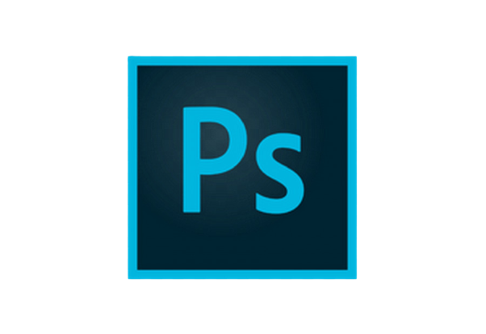

### Hi there 👋,

I'm an undergraduate student at IJSE, looking forward to achieve a greater success through delivering optimum contribution for the working institute and improve my career life by exercising my skills and knowledge in a dynamic and challenge-able working environment.

 

### **Skills & Experience:**

 

 &nbsp;
 &nbsp; &nbsp;
 &nbsp;
 &nbsp;
 &nbsp;
 &nbsp;
 &nbsp;
 &nbsp;
&nbsp;
&nbsp;
&nbsp;

<!--  &nbsp; &nbsp; -->
<!-- &nbsp;
&nbsp;
 -->

 

### **Connect with me:**

 

 &nbsp; &nbsp; &nbsp;

