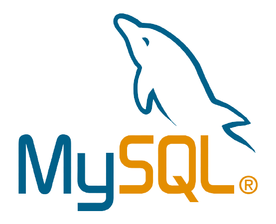
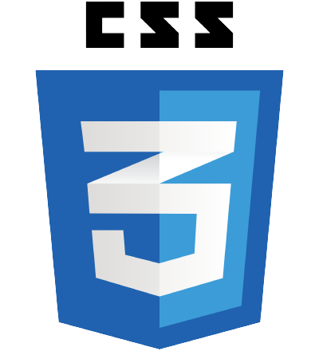

### Hi there 👋,

I'm an undergraduate student at IJSE, looking forward to achieve a greater success through delivering optimum contribution for the working institute and improve my career life by exercising my skills and knowledge in a dynamic and challenge-able working environment.

### **Skills & Experience:**  
     
 &nbsp; 
 &nbsp; &nbsp; &nbsp; 
 &nbsp; &nbsp; 
 &nbsp; 
 

### Connect with me:

 &nbsp; &nbsp; &nbsp; 
  

